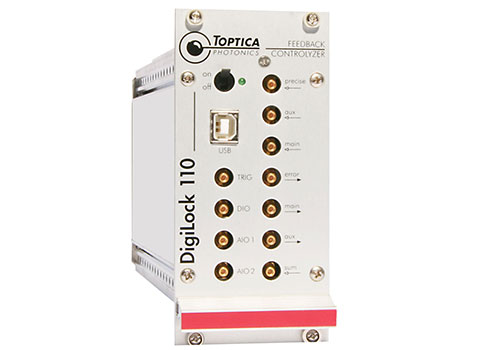
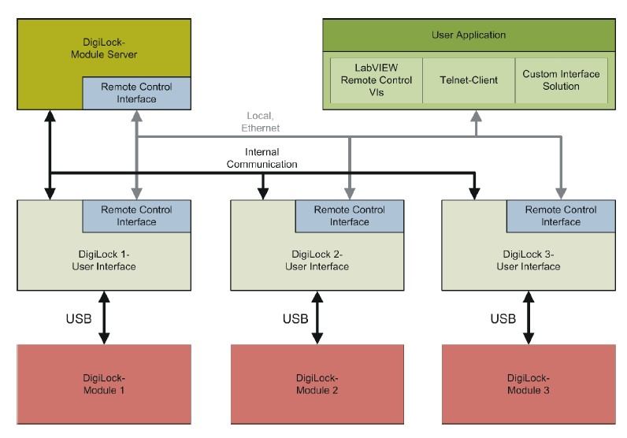

# DigiLock Remote

digilock_remote is a python package to communicate with Digilock 110 modules.

## Digilock 110
[DigiLock 110](https://www.toptica.com/products/tunable-diode-lasers/laser-locking-electronics/digilock-110-digital-locking/) Feedback Controlyzer is a signal processing and feedback electric module provided by Toptica. It can be used in laser driving racks or in a standalone module. 



## Remote control interface
Control of DigiLock 110 is done using property software. The "Digilock Module Server"(DMS) and "Digilock User Interface"(DUI) are running on Windows PC. Each "Digilock User Interface" controls a Digilock module connecting with a USB port. The "Digilock Module Server" and "Digilock User Interface" are providing remote control interface with TCP protocol. Internal telnetlib of python is used to implement connection.



### ports for connection

The default port for DMS is 60000 and for DUI is 60001. IP and ports is shown on "Digilock Module Server" panel.

## Use of this package

See test_*.py for examples.

### install from source
clone and pip install from source.

```
git clone https://github.com/benfre/digilock_remote.git digilock_remote
cd digilock_remote
pip install -e ./digilock_remote
```

### build wheel
```
cd digilock_remote
python setup.py bdist_wheel
```